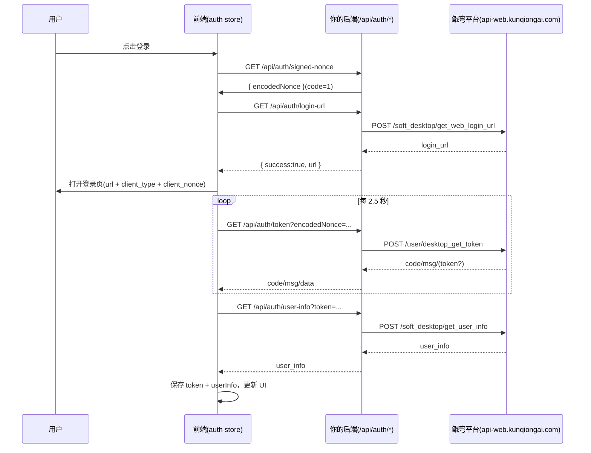

# 鲲穹 Web 登录实现说明（可复用到其他项目）

> 目标：把当前项目里“登录/回调/状态保持”的完整逻辑提炼出来，供其他 Web 项目直接复用。
>
> 适用对象：Vue/React/任意前端 + Java/Node/Python 后端（只要能做代理接口）。

## 1. 当前实现概览

当前项目采用的是**前端发起登录 + 后端代理鲲穹接口 + 前端轮询取 token**的模式。

- 前端登录核心：`frontend/src/stores/auth.ts`
- 后端登录代理：`backend/java-backend/src/main/java/com/exceltool/controller/AuthController.java`
- 登录入口页面：`frontend/src/views/SettingsView.vue`
- 头部登录按钮入口：`frontend/src/layout/MainLayout.vue`
- 前端同源代理：`deploy/docker/nginx.conf`（`/backend/* -> backend:8080/*`）

核心特征：

1. 点击登录后，前端生成（或请求后端生成）`client_nonce`。
2. 前端打开鲲穹登录页（新标签/弹窗）。
3. 前端定时轮询后端 `/api/auth/token?encodedNonce=...`。
4. 轮询拿到 token 后，前端再调 `/api/auth/user-info` 获取头像昵称。
5. token 和 userInfo 写入 `localStorage`，并更新 header 为“头像 + 名称”。
6. 支持刷新恢复、回调参数清理、跨标签同步、取消轮询。

---

## 2. 端到端时序（现网逻辑）

---

## 3. 前端登录状态机（auth store）

文件：`frontend/src/stores/auth.ts`

### 3.1 关键状态

- `token`: 当前登录 token（`localStorage: kq_token`）
- `userInfo`: 头像/昵称（`localStorage: kq_user`）
- `isLoggedIn`: `!!token`
- `isLoggingIn`: 是否正在登录轮询
- `loginError`: 最近一次登录错误信息
- `loginAbortController`: 用于取消轮询

### 3.2 关键本地存储键

- `kq_token`
- `kq_user`
- `kq_login_nonce`
- `kq_login_return_url`
- `kq_auth_callback`

### 3.3 登录主流程 `login()`

1. `isLoggingIn = true`
2. 调 `GET /api/auth/signed-nonce` 获取后端签名 nonce
3. 若 `/signed-nonce` 不存在（404），自动回退 `generateSignedNonceLegacy()`（前端本地签名）
4. 保存 `kq_login_nonce`、`kq_login_return_url`
5. 调 `GET /api/auth/login-url`
6. 拼接登录 URL：`...&client_type=desktop&client_nonce=<encodedNonce>`
7. 打开弹窗/新标签
8. `waitForToken(encodedNonce)` 轮询拿 token
9. `finalizeLoginWithToken(newToken)`：获取 userInfo、写入 localStorage、清理 nonce
10. 成功后关闭弹窗并结束

### 3.4 轮询逻辑 `waitForToken()`

- 轮询间隔：`2500ms`
- 超时：`3min`
- 当 `code===1 && data.token` 时成功
- 超时抛错 `settings.loginTimeout`
- 支持 `cancelLogin()` 中断

### 3.5 页面恢复和回调兼容

- `tryHandleCallbackFromCurrentUrl()`：
  - 兼容从 URL 参数读取 `token/login_token/kq_token`
  - 兼容 `client_nonce/nonce`
  - 解析 `user_info/userInfo`
  - 消费后用 `history.replaceState` 清理 URL 参数

- `resumePendingLoginIfNeeded()`：
  - 页面刷新后若存在 `kq_login_nonce`，自动继续轮询，不中断流程

- 跨标签同步：
  - `window.addEventListener('storage', ...)` 监听 `kq_auth_callback`
  - `window.postMessage` 兼容回调消息（`KQ_AUTH_CALLBACK`）

---

## 4. 后端接口契约（AuthController）

文件：`backend/java-backend/src/main/java/com/exceltool/controller/AuthController.java`

基础路径：`/api/auth`

### 4.1 `GET /api/auth/login-url`

- 入参：`redirectUri?`
- 动作：代理 `POST https://api-web.kunqiongai.com/soft_desktop/get_web_login_url`
- 返回：
  - 成功：`{ success: true, url: "..." }`
  - 失败：`{ success: false, msg: "..." }`

### 4.2 `GET /api/auth/signed-nonce`（推荐）

- 作用：后端生成签名后的 `encodedNonce`，避免前端依赖 `crypto.randomUUID` / `crypto.subtle`
- 返回：
  - 成功：`{ code:1, data:{ encodedNonce:"..." } }`
  - 失败：`{ code:0, msg:"..." }`

### 4.3 `GET /api/auth/token?encodedNonce=...`

- 动作：代理 `POST /user/desktop_get_token`
- 返回：鲲穹标准结构（含 `code/msg/data.token`）

### 4.4 `GET /api/auth/user-info?token=...`

- 动作：代理 `POST /soft_desktop/get_user_info`（header 带 `token`）
- 返回：`user_info`（至少含 `avatar/nickname`）

### 4.5 `GET /api/auth/check-login?token=...`

- 动作：代理 `POST /user/check_login`

### 4.6 `POST /api/auth/logout`

- body：`{ token }`
- 动作：代理 `POST /logout`

### 4.7 其它辅助接口

- `GET /api/auth/adv?position=...`
- `GET /api/auth/custom-url`
- `GET /api/auth/feedback-url`

---

## 5. Header 与设置页联动规则

### 5.1 未登录

- Header 显示：登录/注册按钮
- 个人中心页显示：登录引导卡 + 登录按钮

### 5.2 已登录

- Header 显示：头像 + 昵称（点击跳转个人中心）
- 个人中心页显示：头像、昵称、登录状态、退出按钮

### 5.3 入口位置

- 顶部按钮：`MainLayout.vue` 的 `goToSettings()`
- 设置页登录触发：`SettingsView.vue` 的 `handleLogin() -> authStore.login()`

---

## 6. 可复用到其他项目的“最小实现”

如果你要在新项目复用，最少需要以下模块：

1. 前端 `auth store`（登录、轮询、恢复、退出）
2. 后端 `AuthController`（代理鲲穹 API）
3. UI 接入：
   - Header 登录入口
   - 个人中心页
4. Nginx 同源代理：
   - `/backend/* -> 后端`

---

## 7. 迁移步骤（给新项目）

### 步骤 1：后端先落地

在新项目后端新增 `AuthController`，至少保留：

- `/login-url`
- `/signed-nonce`
- `/token`
- `/user-info`
- `/logout`

### 步骤 2：前端接入 auth store

将登录流程放在单独 store（Pinia/Redux/Zustand 均可），保留：

- `login()`
- `waitForToken()`
- `finalizeLoginWithToken()`
- `resumePendingLoginIfNeeded()`
- `tryHandleCallbackFromCurrentUrl()`
- `logout()`

### 步骤 3：UI 接入

- Header：未登录显示登录按钮，已登录显示头像昵称
- 设置页：未登录时展示登录引导，已登录显示账户信息

### 步骤 4：代理与环境

生产环境推荐：

- 前端 API 基址：`/backend`
- Nginx 反代到后端容器
- 避免浏览器跨域、混合内容问题

### 步骤 5：验收

必须通过：

1. 点击登录能打开鲲穹登录页
2. 登录后 3 分钟内完成 token 获取
3. 刷新页面仍保持登录状态
4. Header 能展示头像昵称
5. 退出登录能清理本地状态

---

## 8. 常见问题与处理

### 问题 A：`crypto.randomUUID is not a function`

原因：浏览器环境不支持。  
处理：

- 优先走后端 `GET /api/auth/signed-nonce`
- 前端仅保留 legacy fallback

### 问题 B：`GET /api/auth/signed-nonce 404`

原因：后端还没升级。  
处理：

- 更新后端到包含该接口的版本
- 或保留前端 fallback（当前项目已实现）

### 问题 C：`/backend/api/... 403`

优先检查：

1. 反代是否命中正确服务（Nginx `location /backend/`）
2. 后端日志具体报错
3. 是否被业务层判定为禁止（不是 CORS）
4. `SECURITY_CORS_ALLOWED_ORIGINS` 是否覆盖当前域名

### 问题 D：登录按钮文字看不见

处理：

- 统一按钮对比度样式（蓝底白字、禁用透明文本）
- 当前项目已在 `SettingsView.vue` 增强样式

---

## 9. 安全建议（给复用项目）

1. **推荐后端签名 nonce**，避免在前端暴露签名逻辑/密钥。
2. 生产环境下不要把签名密钥写死在前端代码。
3. token 仅保存在本域，不跨域透传。
4. 所有登录代理接口必须有超时与异常兜底。
5. 对 URL 参数中的 token 及时清理（当前已做）。

---

## 10. 快速检查清单（上线前）

- [ ] `/api/auth/login-url` 正常
- [ ] `/api/auth/signed-nonce` 正常
- [ ] `/api/auth/token` 能轮询出 token
- [ ] `/api/auth/user-info` 能取到昵称头像
- [ ] Header 登录态切换正常
- [ ] 设置页登录/退出正常
- [ ] 刷新后仍保持登录
- [ ] Nginx `/backend` 反代正常
- [ ] 无跨域/混合内容报错
- [ ] 关键日志可追踪（后端日志有 login/token/user-info 记录）

---

## 11. 推荐复制清单（到新项目）

可以直接参考复制（按需改名）：

1. `frontend/src/stores/auth.ts`
2. `backend/.../AuthController.java`
3. `frontend/src/views/SettingsView.vue` 中登录区块
4. `frontend/src/layout/MainLayout.vue` 的 header 登录态展示
5. `deploy/docker/nginx.conf` 的 `/backend` 反代规则

---

如果要我进一步给你做“跨框架模板”（Vue/React/Next 三套可直接粘贴代码），我可以在这个文档基础上再生成一版 `v2`。
